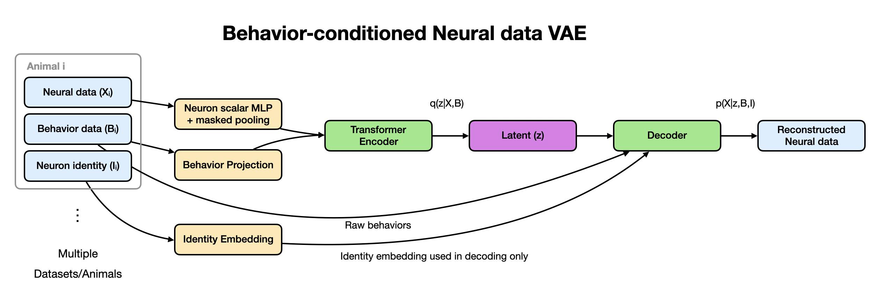

# CeNeuroVAE
[](https://github.com/urlicht/CeNeuroVAE/actions/workflows/test.yml)

ceneurovae is a compact package containing a Behavior-conditioned Neural data Variational Autoencoder (VAE) with transformers. It provides modular components (encoder, decoder, positional encoding, losses, data loaders) and a small training loop function to quickly test it out.

It learns a latent trajectory that explains neural activity while conditioning on observed behaviors and optional neuron identities. Reconstruction is computed per neuron with learned neuron-specific affine parameters (gain/bias).

The model was tested out with the labeled datasets from [Atanas & Kim et. al. 2023](https://doi.org/10.1016/j.cell.2023.07.035). These datasets contain simultaneously recorded whole-brain neural traces and behavioral info such as velocity, feeding, and head curvature. Most of these neurons in the datasets were labeled with NeuroPAL (i.e. neural identities are known).



While the model was tested on these C. elegans datasets, you can easily use this model/package to fit neural and behavioral datasets from any model systems, as long as most neurons have known neural identities.

While there're countless potential applications, some first order things you could do after model fitting:
- examine shared dynamics across neurons and datasets/animals.
- compress high-dimensional neural recordings into a compact latent trajectory z_t.
- examine the joint representation of behaviors and neural info.
- predict neural activity given behaviors. you can drive the model with an arbitrary set of behaviors and see how specific neurons respond.
- reconstruct missing or noisy neural signals by leveraging the mask-aware reconstruction.

---

## Overview

ceneurovae implements a configurable VAE for sequential data. Core ideas:

- Encoder compresses input sequences to a low-dimensional latent vector z per time.
- A probabilistic latent prior (N(0, I)) and a learned posterior q(z|x) are used.
- Decoder reconstructs sequences from z.
- Loss is reconstruction term (MSE / Huber) + KL divergence; KL weight can be scheduled to prevent posterior collapse.

---

## At a glance

- **Inputs**
  - Neural signals `X ∈ ℝ^{B×N×T}`
  - Observation mask `M ∈ {0,1}^{B×N×T}`
  - Behavioral channels `Bx ∈ ℝ^{B×T_b×T}`
  - Neuron identity indices `I ∈ {0,…,n_id-1}^{B×N}` (`0` = unknown)
- **Backbone**
  - Pooled neuron token (masked mean over neurons) + projected behavior token → **Transformer encoder** over time
- **Latent**
  - Per-time posterior `q(z_t|·) = N(μ_t, σ_t²)`, reparameterized
- **Decoder**
  - Combines `[z_t; b_t]` to produce a **time context**, then conditions on per-neuron identity embedding to predict signals with neuron-wise **gain/bias**
- **Losses**
  - Masked reconstruction loss (MSE or Huber) + `β`-weighted KL with optional **freebits** `τ`

---

## Tensor shapes & symbols

| Symbol | Meaning |
|---|---|
| `B` | batch size |
| `N` | # neurons |
| `T` | # time steps |
| `T_b` | # behavior channels |
| `D_n` | `cfg.neuron_token_dim` |
| `D_m` | `cfg.model_dim` |
| `L` | `cfg.latent_dim` |
| `E_i` | `cfg.neuron_embed_dim` |
| `H_d` | `cfg.decoder_hidden` |

### Inputs

| Name | Shape | Dtype | Notes |
|---|---|---|---|
| `X` | `(B, N, T)` | float | Neural traces (e.g., ΔF/F, spikes, etc.) |
| `M` | `(B, N, T)` | `{0,1}` / float | Observation mask; 0’s are ignored in pooling & loss |
| `Bx` | `(B, T_b, T)` | float | Behavior covariates aligned to `T` |
| `I` | `(B, N)` | long | Neuron identity IDs; **0 means unknown** |

### Outputs (`forward`)

```python
{
  "reconstruction": recon,  # (B, N, T)
  "mu":            mu,      # (B, T, L)
  "z":             z,       # (B, T, L)
  "loss_rec":      loss_rec,
  "loss_kl":       loss_kl,
  "loss_sum":      loss_sum
}
```

---

## Architecture

### 1) Neuron token (masked pooling)
- Per-neuron scalar `(·,1)` → MLP → `D_n`
- Masked mean across neurons at each `t`
- Shapes: `(B*T, N, 1)` → MLP → `(B*T, N, D_n)` → masked mean → `(B, T, D_n)`

### 2) Behavior token
- Permute `Bx: (B, T_b, T) → (B, T, T_b)`
- Linear → GELU to width `beh_width = max(32, model_dim//16)`
- Output: `(B, T, beh_width)`

### 3) Fusion & temporal encoder
- Concatenate `[n_token, b_token]` → Linear → GELU → Dropout → **PositionalEncoding**
- **TransformerEncoder** (`n_layers`, `n_heads`, `d_model=D_m`) over time → `h ∈ ℝ^{B×T×D_m}`

### 4) Posterior heads
- `mu = Linear(D_m → L)`, `logvar = Linear(D_m → L)`
- Reparameterization (for gradients):  `z_t = mu_t + eps * exp(0.5 * logvar_t)`

### 5) Decoder
- Time context: `dec_time = MLP([z_t; b_t] → H_d)` with two GELU layers
- Neuron identity:
  - `id_e = Embedding(n_identities, E_i)`  
  - `id_to_affine(id_e) → (gain, bias) ∈ ℝ^{B×N}`
- Prediction:
  - Tile `dec_time` across neurons and concat with `id_e`
  - `neuron_head([dec_time_t; id_e_n]) → scalar`
  - Apply affine: `pred_tn = head(...) * gain_n + bias_n`
  - Permute back to `(B, N, T)`

### 6) Behavior dropout
In some cases, neurons can be reconstructed from the behavioral data alone, without using the latents. To prevent this, behavior info dropout is used.
- During training, with **p=0.1**, behavior inputs to the decoder are zeroed:  
  `if self.training and torch.rand(()) < 0.1: b_t = 0`

---

## Losses
The model optimizes a combination of reconstruction loss and KL divergence, with options for stability and regularization.

1. **Masked Reconstruction Loss**
   - Measures how well the model can reconstruct the observed neural signals.
   - Only positions where the mask `M = 1` are included in the loss.
   - Choice of loss function:
     - **MSE** (mean squared error) — penalizes squared differences.
     - **Huber loss** — less sensitive to outliers, smooth transition between L1 and L2.

2. **KL Divergence Loss**
   - Regularizes the approximate posterior distribution `q(z|X,B)` toward the standard normal prior `N(0, I)`.
   - Encourages the latent variables to stay close to a Gaussian manifold.
   - **Freebits option:** You can enforce a minimum contribution (`τ`) per latent dimension, which prevents “posterior collapse” (where latents carry no information).

3. **Total Loss**
   - The final training objective is:
     - `total_loss = reconstruction_loss + beta_kl * kl_loss`
   - `beta_kl` is a configurable weight that controls the tradeoff between reconstruction quality and latent regularization.


---

## Example usage
### Training
```python
import torch
import torch.nn as nn

from ceneurovae.model import VAEConfig, NeuroBehaviorVAE
from ceneurovae.import_data import import_h5
from ceneurovae.data import build_loaders
from ceneurovae.optimizer import build_optimizer, build_scheduler
from ceneurovae.train import fit_model

path_data = "..."
datasets, labels = import_h5(path_data)

device = torch.device("cuda")
cfg = VAEConfig(n_identities=155, behavior_dim=3)
model = NeuroBehaviorVAE(cfg).to(device)

n_epoch = 100

optim = build_optimizer(model, lr=1e-3)

scheduler_seq, scheduler_plat, cosine_done = build_scheduler(
  optim, total_epochs=n_epoch, warmup_epochs=10,
  min_lr_ratio=0.05, use_plateau=True,
  cosine_portion=0.85
)

loader_train, loader_val, train_uids, val_uids = build_loaders(datasets, window_T=100,
                                                               stride=50, batch_size=8, num_workers=0)

list_loss, list_lr = fit_model(model, loader_train, loader_val, n_epoch, optim,
                               scheduler_seq, scheduler_plat, cosine_done, device)
```

### Reconstruction & Latents
```python
device = torch.device("cuda")
model.eval()

# neural trace reconstruction
recon = get_full_sequence_reconstruction(model, X, M, Bx, I, window_T=100, stride=50, device=device)

# get the latents
z_full = get_full_sequence_latent(model, X, M, Bx, I, window_T=100, stride=50, device=device)
```

### Decoding given latents
```python
# decode from z
decode_from_z(model, z, Bx, I)

# decode full sequence from z
decode_full_sequence_from_z(model, z_full, Bx, I, window_T=200, stride=100, device="cuda")
```

---

## Data & IO

- Data loaders should yield tensors shaped `(B, T, C)` and optionally masks for missing data.
- Normalization: normalize neural traces per neuron and behavioral variables globally.

---
